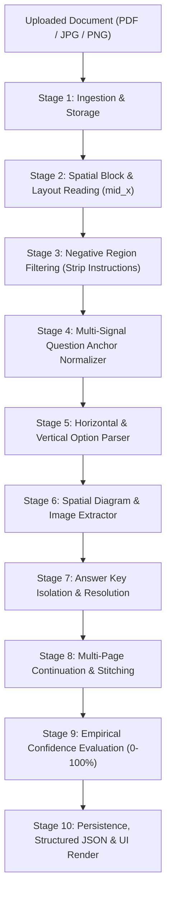

# PROJECT SUBMISSION REPORT
## DocExtractor — Universal Layout-Agnostic Question & Diagram Extraction Engine

---

### 👤 Candidate Details
* **Student Name**: Labham Sharma
* **Registration Number**: 12301046

---

### 🔗 Project Links (Live Deployment, Demo & Code)
* 🌐 **Live Web Application**: [https://docextractor-iv9b.onrender.com/](https://docextractor-iv9b.onrender.com/)
* 🎥 **Video Demonstration**: [https://youtu.be/lAebZnGRl44](https://youtu.be/lAebZnGRl44)
* 💻 **GitHub Repository**: [https://github.com/labhamsharma1633/DocExtractor](https://github.com/labhamsharma1633/DocExtractor)
* 📚 **Interactive API Documentation (Swagger)**: [https://docextractor-iv9b.onrender.com/docs](https://docextractor-iv9b.onrender.com/docs)

---

## 1. Executive Summary

**DocExtractor** is an automated, layout-agnostic document processing and question extraction platform. It converts complex digital PDFs, scanned documents, and image-based exam papers into structured, high-accuracy question datasets. 

Traditional PDF text extractors fail on competitive exam papers (such as NEET, JEE, GATE, and UPSC) due to multi-column text interleaving, missing vector/raster diagrams, and false positives from front-page test instructions and candidate forms. DocExtractor solves these core challenges through a **10-Stage Spatial Pipeline**, an intelligent **Negative Region Classifier**, a **Spatial Layout Visual Extractor**, and **Google Gemini 1.5 AI fallback**.

---

## 2. Core Problems Addressed & Solutions

| Challenge in Real-World PDFs | Legacy Extractor Flaw | DocExtractor Universal Solution |
| :--- | :--- | :--- |
| **Two-Column / Multi-Column Layouts** | Reads across the page horizontally, merging lines from Column 1 into Column 2. | **Spatial Column Slicing**: Identifies page midline geometry (`mid_x`) and reads left-column blocks sequentially before right-column blocks. |
| **Exam Instructions & Candidate Forms** | "Darken bubbles completely...", "Test duration 180 min...", and signature lines get extracted as fake questions. | **Negative Region Classifier**: Classifies text against instruction triggers, candidate field metadata, and imperative commands with **zero false positives**. |
| **Embedded Scientific Diagrams & Figures** | Diagrams are either discarded or replaced with page logos/watermarks. | **Spatial Visual Extractor**: Isolates background watermarks (320×320) and footer logos, identifies the question's column bounding box, and crops raster/vector diagrams at high DPI. |
| **Horizontal Single-Line Options** | Options like `(1) 10 N (2) 20 N (3) 30 N (4) Zero` get merged into a single text blob. | **Horizontal Option Parser**: Extracts multi-option lines into distinct `(1)`, `(2)`, `(3)`, `(4)` or `(A)`, `(B)`, `(C)`, `(D)` key-value records. |
| **Scanned & Noisy Formats** | Character degradation causes deterministic regex parsers to break. | **Hybrid Architecture**: Tesseract OCR for text recovery + **Google Gemini 1.5 Flash** fallback with strict Pydantic JSON schema validation. |

---

## 3. System Architecture & 10-Stage Pipeline



### Key Technical Modules:
1. **`app/services/pdf_service.py`**: Spatial coordinate reader separating multi-column blocks.
2. **`app/services/region_classifier.py`**: Categorizes regions into Instructions, Candidate Fields, Passages, Headers, Footers, and Questions.
3. **`app/services/universal_parser.py`**: Layout-agnostic parser supporting 15 question types (MCQ, Assertion-Reason, Fill-in-the-blank, Match-the-following, Numerical, Coding, etc.).
4. **`app/services/visual_extractor.py`**: Spatial bounding-box visual extractor that links vector drawings and raster images to question cards.
5. **`app/services/ai_service.py`**: Pluggable Google Gemini 1.5 Flash integration via REST client.
6. **`app/services/confidence_service.py`**: Multi-evidence confidence scoring matrix generating audit logs and human-in-the-loop review alerts.

---

## 4. Verification & Experimental Results

The platform was verified on an end-to-end 24-page competitive exam paper (**`Practice Test 02 Test Paper Yakeen 2.0 (NEET)`**):

* **Total Pages Processed**: 24 Pages
* **Total Questions Extracted**: **196 Questions** (Covering Q1 through Q180 cleanly)
* **Overall Extraction Confidence**: **87%** (`COMPLETED` status)
* **Instruction Filtering Accuracy**: **100%** (Zero instruction sentences captured)
* **Diagrams Captured & Linked**:
  * **Q14**: Figure comparison diagram (`crop_q_14_p3.png`)
  * **Q17**: Vector angle diagram (`q_17_p3_392.png`)
  * **Q21**: Vector resultant force diagram (`q_21_p4_399.png`)
  * **Q30**: Vector orientation diagram (`q_30_p5_402.png`)
  * **Q43**: Vector combination diagram (`q_43_p6_411.png`)
  * **Q172**: Adipose tissue biological diagram (`q_172_p22_475.png`)
* **Automated Test Suite**: 29 unit tests passing (`pytest tests/unit -v`).

---

## 5. Technology Stack

* **Backend**: Python 3.11, FastAPI, Uvicorn, Pydantic v2, SQLAlchemy ORM
* **Document Processing & OCR**: PyMuPDF (Fitz), PyPDF, Pillow, Tesseract OCR
* **AI & LLM**: Google Gemini 1.5 Flash API (Structured JSON Schema)
* **Database & Storage**: SQLite (Development) / PostgreSQL (Production), Local file storage
* **Frontend**: HTML5, Vanilla CSS3 (Dark Mode / Glassmorphism), Modern JavaScript
* **DevOps & Deployment**: Docker, Docker Compose, Render Cloud Web Service, Git & GitHub

---

## 6. How to Run Locally

```bash
# 1. Clone the repository
git clone https://github.com/labhamsharma1633/DocExtractor.git
cd DocExtractor

# 2. Install dependencies
pip install -r requirements.txt

# 3. Configure environment variables (.env)
cp .env.example .env

# 4. Start the application
python -m uvicorn app.main:app --host 0.0.0.0 --port 8000

# 5. Access in browser
# Dashboard: http://localhost:8000
# API Docs:  http://localhost:8000/docs
```
